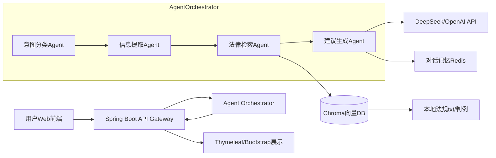

# 背景

为了解决租房可能遇到的各种问题，我开发了这个智能体，并且实现从java到AI的实际业务切换


# 技术架构




# 快速开始
## 安装环境：
macOS
homebrew
IDEA

## 容器

## 后端环境：
java17
```sh
brew install java17
```
maven
```sh
brew install maven
```
## 数据库：
```sh


```


# 后记
高频，高密度，高重复，是我设计AI智能体的需求初衷。
其实作为一个实际的活生生的人，我更倾向于找房、车、教育、量化、投资类的AI智能体，但是因为这类内容比较重要（必将涉及到人类社会个体的大量资源的倾斜），各个行业领头已经做到了大量的实践与商业化，同时，很多智能体因为领域较大，更加抽象，对于一个小项目而言过于麻烦，对于我而言，26岁想解决这些个问题，还需要一定阅历。以博弈论为例，除了需要学习金融知识，也要学习各类领域知识，不只是数学，另外，实际的操作，博弈论的计算，实际的快速反应，学习之前，中、后，应用的前中后，实际的反馈完全不一样。花费半年学习到的基础博弈论入门，拿到的技能仍然不足以解决大量问题，更别说《思考，快与慢》以及网格博弈等比较新的技术领域了
因此我转向了另一个更可能闭环，也就是我的这个项目。期待能有新的想法相互碰撞，让我及时更新。感谢大家指摘，如果喜欢的话可以加个好友一起交流
vx：ayuthayangkor